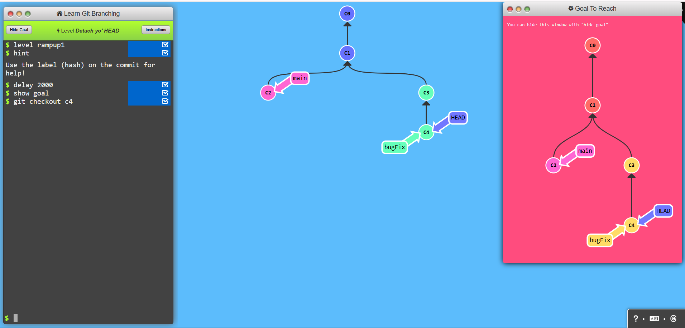
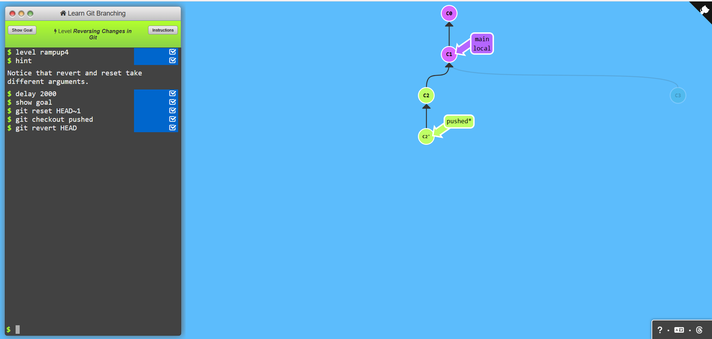

# Ramping Up

## Task 1: Detach yo' HEAD

### Commands used:
- git checkout

## Task 2: Relative Refs (^)

### Commands used:
- git checkout

## Task 3: Relative Refs #2 (~)

### Commands used:
- git branch -f
- git checkout

## Task 4: Reversing changes in Git

### Commands used:
- git checkout
- git reset
- git revert