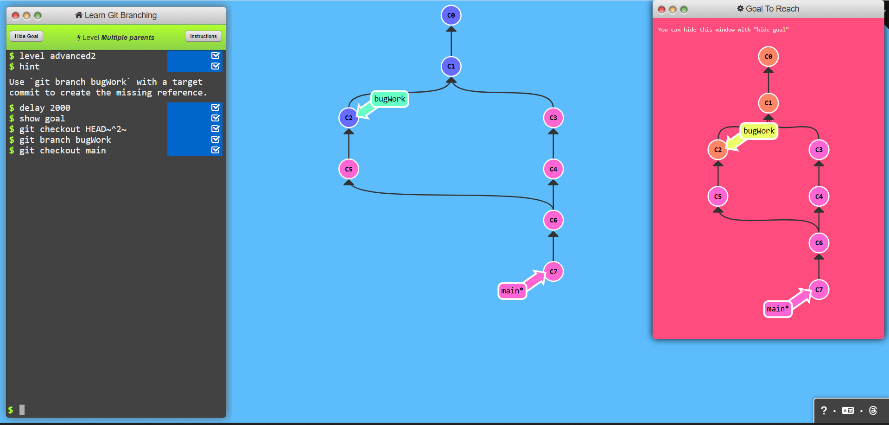

# Advanced Topics

## Task 1: Rebasing over 9000 times

### Commands used:
- git rebase
- git checkout

## Task 2: Multiple Parents

### Commands used:
- git branch
- git checkout

  
## Task 3: Branch Spaghetti

### Commands used:
- git checkout
- git rebase
- git rebase -i