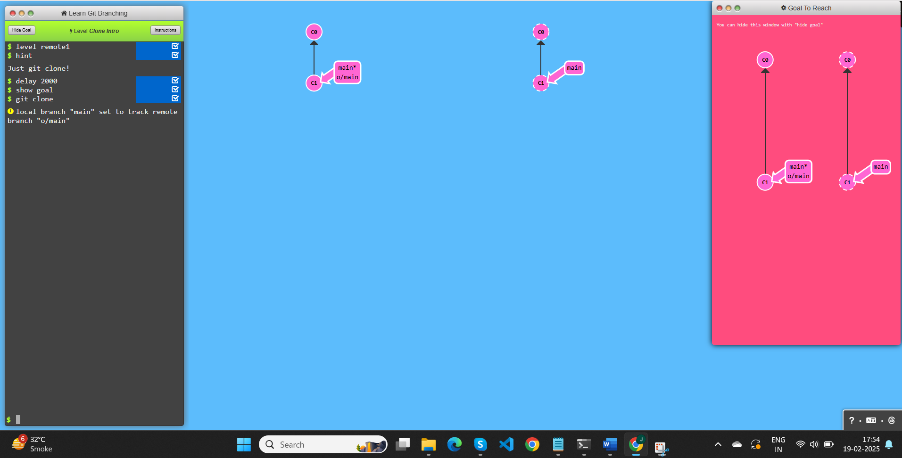
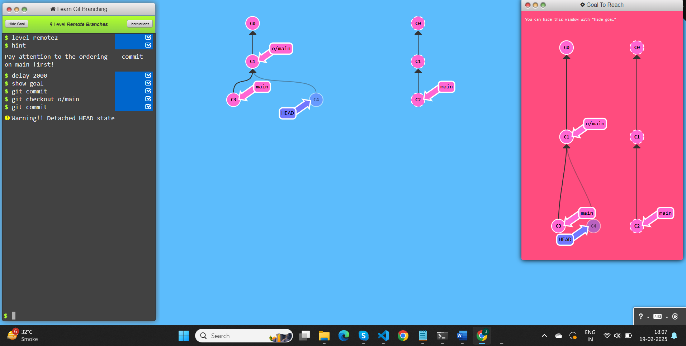
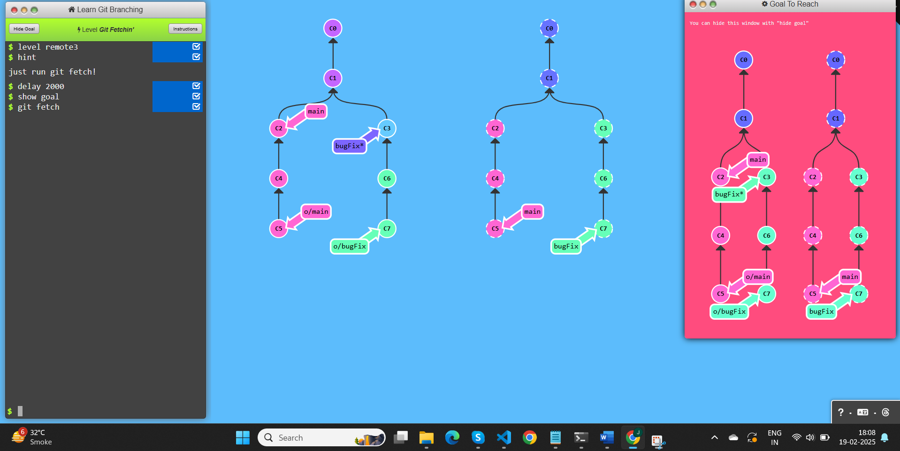
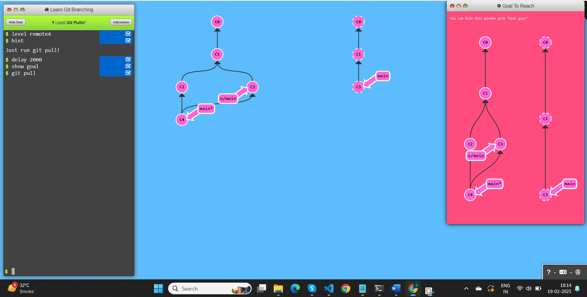
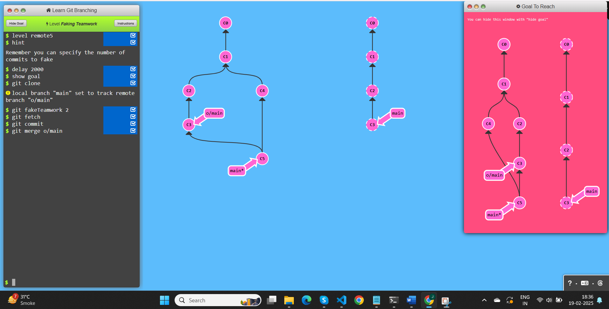
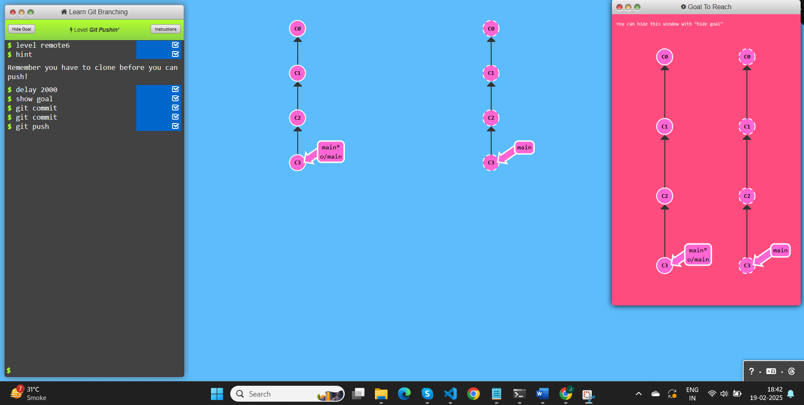
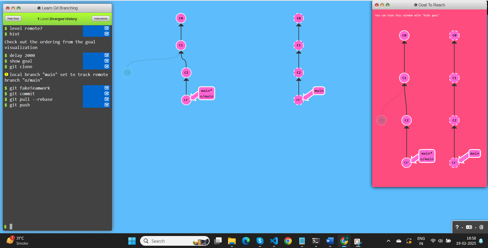
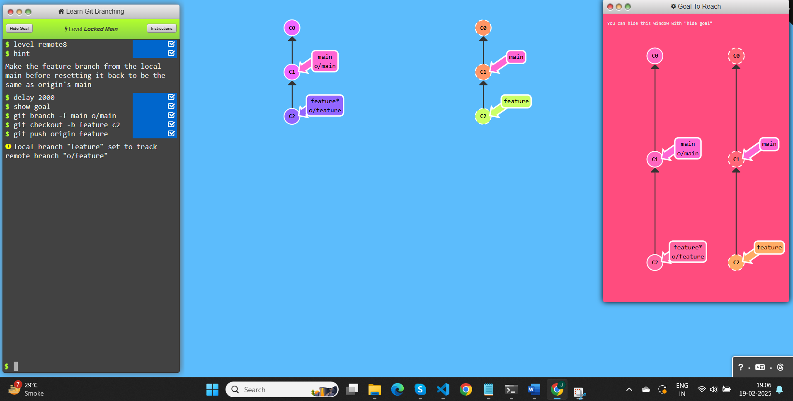

# Push & Pull -- Git Remotes!

## Task 1: Clone Intro

### Commands used:
- git clone

## Task 2: Remote Branches

### Commands used:
- git commit
- git checkout o/main
- git commit

## Task 3: Git Fetching

### Commands used:
- git fetch

## Task 4: Git Pulling

### Commands used:
- git pull

## Task 5: Faking Teamwork

### Commands used:
- git fakeTeamwork 2
- git fetch
- git commit
- git merge o/main

## Task 6: Git Pushing

### Commands used:
- git commit
- git commit
- git push

## Task 7: Diverged History

### Commands used:
- git fakeTeamwork 
- git commit
- git pull --rebase
- git push

## Task 8: Locked Main

### Commands used:
- git branch -f main o/main
- git checkout -b feature c2
- git push origin feature