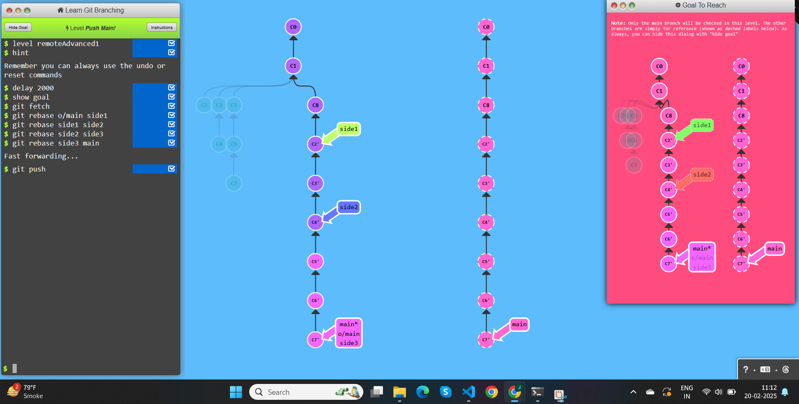
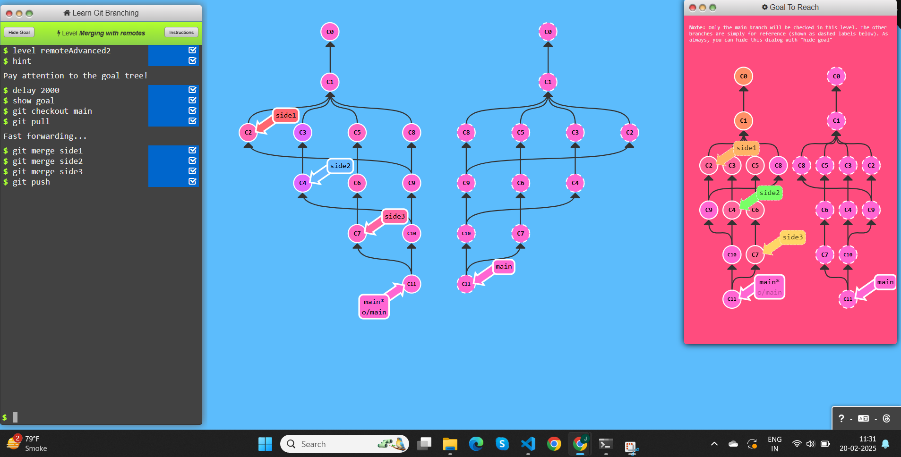
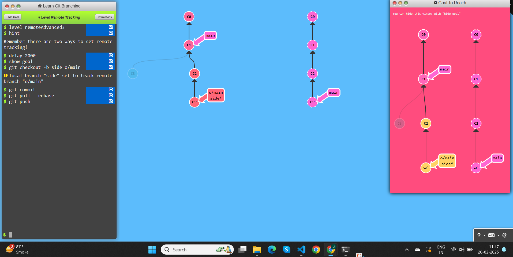

# To Origin And Beyond -- Advanced Git Remotes!

## Task 1: Push Main!

### Commands used:
- git fetch
- git rebase
- git push

## Task 2: Merging with remotes

### Commands used:
- git checkout
- git pull
- git merge
- git push

## Task 3: Remote Tracking

### Commands used:
- git checkout
- git commit
- git pull --rebase
- git push

## Task 4: Git push arguments

### Commands used:
- git push origin main
- git push origin foo

